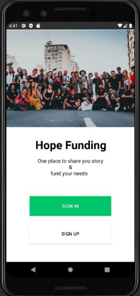
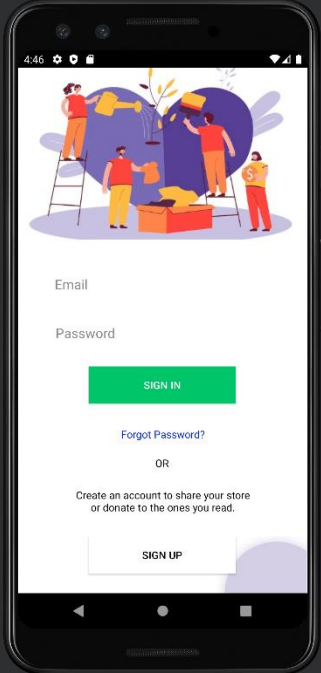
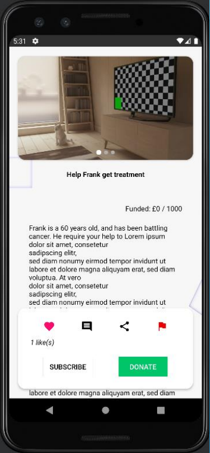

# Crowd Funding Android App

This project was developed as part of my university coursework at Birmingham City University. It is an Android app designed to allow users to upload posts requesting financial help, donate, set up subscriptions, and claim rewards.

## Key Features:
- Upload posts to request financial assistance
- Donate or set up subscriptions
- Earn reward points for donations or subscriptions (redeemable for free drinks)
- Engage with posts by commenting, liking, reporting, and sharing
- Firebase integration for storage of images, user data, post data, and comments

**Please note**: This project was created for academic purposes and does not require updates or maintenance.

## Technologies Used:
- Android Studio
- Firebase
- Java

## Screenshots

